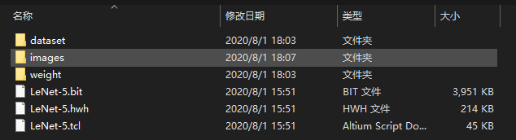
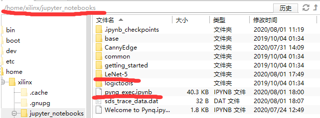
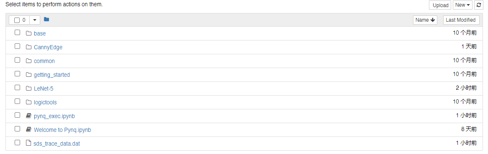
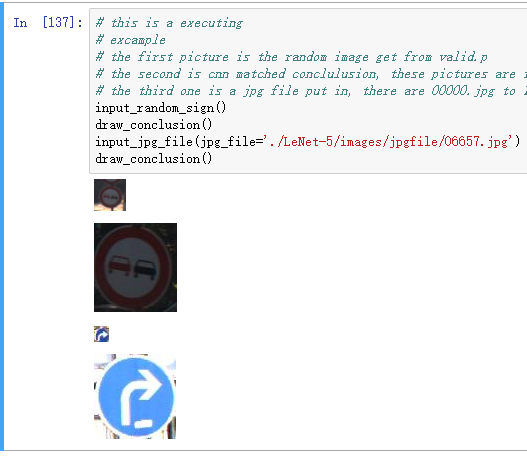

# Traffic-sign-recongnition-on-PYNQ-Z2
> 2020年新工科联盟-Xilinx暑期学校（Summer School）项目。

## 一、项目总览	Overview

#### 设计概要	Summary：

​	本设计是基于神经网络LeNet-5的网络架构进行参数上的微调所形成的神经网络结构。经TensorFlow2进行训练得到各层的权重参数和偏置参数，再利用HLS在PL端形成神经网络的加速器，将权重和偏置参数导入PL端中实现神经网络加速的目的。
​	本设计的目的是加速神经网络最终达到能够识别交通标识。在其中，我们学习到了如何利用TensorFlow2进行网络结构的搭建和训练，如果利用HLS快速的搭建已知的网络结构，如何利用HLS合理分配存储空间和缓存实现数据的高速流通。
​	交通标识的识别在实际中有运用价值，在无人驾驶等智能驾驶领域都需要有交通标志识别的运用空间。但本设计暂时还未训练带有交通标识定位的能力（只能进行分类），所以还有发展空间。

This design is a neural network structure formed by fine-tuning the parameters based on the network architecture of the neural network LeNet-5. 
After training with TensorFlow2, the weight parameters and bias parameters of each layer are obtained, and then the HLS is used to form the accelerator of the neural network on the PL end, and the weight and bias parameters are imported into the PL end to achieve the purpose of neural network acceleration.

​ The purpose of this design is to accelerate the neural network to finally be able to recognize traffic signs. 
In it, we learned how to use TensorFlow2 for network structure construction and training, if HLS is used to quickly build a known network structure, how to use HLS to reasonably allocate storage space and cache to achieve high-speed data circulation.

​ The recognition of traffic signs has practical value in practice, and there is a need for the application of traffic sign recognition in the field of intelligent driving such as unmanned driving. 
However, this design has not yet trained the ability to locate traffic signs (only for classification), so there is still room for development.
#### 计划实现	Planning：

​    1、完成神经网络的训练

  Train the neyron network

​    2、完成神经网络加速器的设计

Design the hardware accelerator

​    3、完成PS端控制的实现

Complete PS controling

​    4、将PS端和PL端结合完成整个神经网络加速的设计

System the PS and PL to accelerate neuron netwwork

​    5、进一步优化系统的延时，提高加速的效果

Optimize more

#### 已实现功能	Done：

​    1、完成神经网络的训练。

Train the neyron network

​    2、完成神经网络加速器的设计。

Design the hardware accelerator

​    3、完成PS端控制实现。

Complete PS controling

​    4、完成PS端和PL端结合完成整个神经网络加速的设计

System the PS and PL to accelerate neuron netwwork

#### 组内成员：

  范峻凌  20BO179A  西南交通大学(swjtu.edu.cn)	<fanjunling00@gmail.com>

  孔欣杰  20BO177A  西南交通大学(swjtu.edu.cn)	<13136177656@163.com>

  翟林帆  20BO178A  西南交通大学(swjtu.edu.cn)	


#### 使用平台：

##### 	硬件平台	Hardware Platform：

​			pynq-z2（无其他外设）

##### 	神经网络训练环境	Network Training Environment：

​			python 3.7

​			tensorflow-gpu 2.2.0 (with GTX1060 6GB)

​			numpy 1.18.5


## 二、仓库目录 Category：

  --> Sources

    --> hw_sources  
    
      ---> LeNet.cpp  hls顶层文件（HLS top file）

  --> hw_lib:

    ---> layer_lib.h


  --> sw_sources:

    ---> cnn.py // To train the model 
    
    ---> data_pre_handle.py // Deal with the data got from 
    
  <http://benchmark.ini.rub.de/?section=gtsrb&subsection=dataset>
    
    ---> pynq_exec.ipynb // run on pynq-z2

--> ExecutableFiles:

    --> hw_bitstream:
    
      --> LeNet-5.bit 
    
      --> LeNet-5.hwh
    
      --> LeNet-5.tcl
    
    --> jupyter_file:
    
      --> pynq_exec.ipynb // run on pynq-z2, same with pynq_exec.ipynb above

# 三、怎样直接使用 Quick Start:

## 1.文件准备 Files:

下载这个压缩包 <https://pan.baidu.com/s/1XeytL4js1w_wyrdZcjPZpw>
> 提取码：qmsy
> 
解压后获得文件夹“LeNet-5”

> 为啥叫LeNet呢？其实这个网络是我们自己建立的模型，但是最开始我们想直接用Lenet的，就没改名字

其目录结构如下



其中：

--> datasets // 包含了转化后的一些数据集

--> images // 包含了可以自行读取的图片和用于显示结果的图片
  
    --> typical // 用于显示的图片
    --> jpgfile // 用户可自行读取的图片

--> weight // 包含了模型的权重

--> LeNet-5.bit

--> LeNet-5.hwh

--> LeNet-5.tcl //用于加载PL端的文件

通过 Final Shell 等SSH软件将LeNet-5文件夹传到PYNQ-Z2的下面目录下
>/home/xilinx/jupyter_notebooks

并复制这个文件 <https://github.com/vanDeagle/Traffic-sign-recongnition-on-PYNQ-Z2/blob/master/ExecutableFiles/jupyter_file/pynq_exec.ipynb>
到 
>/home/xilinx/jupyter_notebooks

> 因为pynq_exec.ipynb中我使用了相对路径，所以文件路径要放对

完成后文件结构如下图




## 2.查看结果 Execute:

### 登入PYNQ-Z2的 jupyter_notebook



打开pynq_exec.ipynb

### 执行第一个cell
```
from PIL import Image
import numpy as np
from IPython.display import display
from pynq import Xlnk
from pynq import Overlay
import pickle
import random

#l load block design
System = Overlay("./LeNet-5/LeNet-5.bit")

# make np.array to print completely
# you can commit this
np.set_printoptions(threshold=np.inf)

# instance xlnk
xlink = Xlnk()

# the hls ipcore
cnn = System.LeNet_Hw_0

# load trained weights and bias data 
# conv layer1
conv1_w_d = np.array(np.load('./LeNet-5/weight/conv1_weight.npy'))
conv1_w_n = conv1_w_d
conv1_w_d = conv1_w_d.flatten()
conv1_b_d = np.array(np.load('./LeNet-5/weight/conv1_bias.npy'))
# convlayer 2
conv2_w_d = np.array(np.load('./LeNet-5/weight/conv2_weight.npy'))
conv2_w_d = conv2_w_d.flatten()
conv2_b_d = np.array(np.load('./LeNet-5/weight/conv2_bias.npy'))
# fc layer 1
fc1_w_d = np.array(np.load('./LeNet-5/weight/fc1_weight.npy'))
fc1_w_d = fc1_w_d.flatten()
fc1_b_d = np.array(np.load('./LeNet-5/weight/fc1_bias.npy'))
# fc layer 2
fc2_w_d = np.array(np.load('./LeNet-5/weight/fc2_weight.npy'))
fc2_w_d = fc2_w_d.flatten()
fc2_b_d = np.array(np.load('./LeNet-5/weight/fc2_bias.npy'))


# allocate cma storage for weights and bias
conv1_w = xlink.cma_array(dtype=np.float32, shape=conv1_w_d.shape)
conv1_b = xlink.cma_array(dtype=np.float32, shape=conv1_b_d.shape)
conv2_w = xlink.cma_array(dtype=np.float32, shape=conv2_w_d.shape)
conv2_b = xlink.cma_array(dtype=np.float32, shape=conv2_b_d.shape)
fc1_w = xlink.cma_array(dtype=np.float32, shape=fc1_w_d.shape)
fc1_b = xlink.cma_array(dtype=np.float32, shape=fc1_b_d.shape)
fc2_w = xlink.cma_array(dtype=np.float32, shape=fc2_w_d.shape)
fc2_b = xlink.cma_array(dtype=np.float32, shape=fc2_b_d.shape)
output_data = xlink.cma_array(shape=(43,), dtype=np.float32)
input_data = xlink.cma_array(shape=(3072,),dtype=np.float32)

# value the cma_arrays
for i in range(0, len(conv1_w)):
    conv1_w[i] = conv1_w_d[i]
    
for i in range(0, len(conv2_w)):
    conv2_w[i] = conv2_w_d[i]
    
for i in range(0,  len(fc1_w)):
    fc1_w[i] = fc1_w_d[i]

for i in range(0, len(fc2_w)):
    fc2_w[i] = fc2_w_d[i] 

for i in range(0, len(conv1_b)):
    conv1_b[i] = conv1_b_d[i]
    
for i in range(0, len(conv2_b)):
    conv2_b[i] = conv2_b_d[i]
    
for i in range(0, len(fc1_b)):
    fc1_b[i] = fc1_b_d[i]

for i in range(0, len(fc2_b)):
    fc2_b[i] = fc2_b_d[i]
```
正确地导入各种库、读入参数、申请对应内存

### 执行第二个cell
```
# write the address to the ip core
cnn.write(0x10, conv1_w.physical_address)
cnn.write(0x18, conv1_b.physical_address)
cnn.write(0x20, conv2_w.physical_address)
cnn.write(0x28, conv2_b.physical_address)
cnn.write(0x30, fc1_w.physical_address)
cnn.write(0x38, fc1_b.physical_address)
cnn.write(0x40, fc2_w.physical_address)
cnn.write(0x48, fc2_b.physical_address)
cnn.write(0x50, input_data.physical_address)
cnn.write(0x58, output_data.physical_address)

# you can also load these datasets, but it may take too much storage
#training_file = './LeNet-5/dataset/train.p'
# testing_file = './LeNet-5/dataset/test.p'
validation_file = './LeNet-5/dataset/valid.p'


# read these data files
# with open(training_file, mode='rb') as f:
#     train = pickle.load(f)
with open(validation_file, mode='rb') as f:
    valid = pickle.load(f)
# with open(testing_file, mode='rb') as f:
#     test = pickle.load(f)

# get and handle x and labels, train, verify, test
# X_train, y_train = train['features'], train['labels']
X_valid, y_valid = valid['features'], valid['labels']
# X_test, y_test = test['features'], test['labels']

```
写入了权重数据、读取数据集的数据

### 执行第三个cell
```
# use this def to input a ramdom image from valid.p
# you can also input train.p or test.p similarly
def input_random_sign():
    global input_data
    pic = random.randint(0, 4409)
    image = Image.fromarray(X_valid[pic], 'RGB') 
    display(image)
    input_data_x = X_valid[pic].flatten()/255.
    # X_test = X_test / 255.
    for i in range(0, 32*32*3):
        input_data[i] = input_data_x[i]
    cnn.write(0x00, 0x01)

# use this def to read out the conclusion
def draw_conclusion():    
    global output_data
    i = cnn.read(0x00)
    while i != 6:
        i = cnn.read(0x00)
    label = np.argmax(output_data)
    display(Image.open('./LeNet-5/images/typical/'+format(label,'01d')+'.jpg'))

# use this def to input a jpg file for recongnition
def input_jpg_file(jpg_file=None):
    global input_data
    source_img = Image.open(jpg_file)
    display(source_img)
    array = np.array(source_img)
    new_img_32 = source_img.resize((32, 32), Image.BILINEAR)
    input_array = np.array(new_img_32)
    input_array = input_array.flatten()
    for i in range(0, 32*32*3):
        input_data[i] = input_array[i]
    cnn.write(0x00, 0x01)
```
这个cell定义了三个函数功能分别如注释所说

input_random_sign() 

将随机读取的数据集中一个batch的数据写入神经网络

draw_conclusion()

给出输出结果（输出结果会根据输出的43维向量（共有43种交通标志）从 LeNet-5/images/typical 中找到对应的图片进行显示）

input_jpg_file()

会输入一张jpg格式的图片进入神经网络，依旧可以通过 draw_conclusion() 函数进一步输出结果

### 执行第四个cell
```
# this is a executing
# excample
# the first picture is the random image get from valid.p
# the second is cnn matched conclulusion, these pictures are in the depository of LeNet-5/images/typical/...
# the third one is a jpg file put in, there are 00000.jpg to 12629.jpg in path LeNet-5/images/jpgfile/...
input_random_sign()
draw_conclusion()
input_jpg_file(jpg_file='./LeNet-5/images/jpgfile/06657.jpg')
draw_conclusion()
```
如下图



我们先给了一组随机的数据集中的图片

再读取了一次输出，程序打印出同类的图片来告知结果是否正确

然后我们读取了包中的12630图片中的一张来进行识别

同样输出了正确结果

# 四、总结  Result：

这次的项目 “交通标志识别” 算是把所有流程走通了一遍，并成功实现了在PYNQ-Z2上利用HLS编写IP核对神经网络进行硬件加速，也算是达到了自己对于这次暑期学校的预期。

但是，我们并没有太多的时间来进行指标的测试了，很多地方的算法、代码都还可以进行更好的优化、神经网络模型还可以进一步进行优化、还可以训练更准确的模型，在FPGA器件硬件限制内可以达到更好的效果